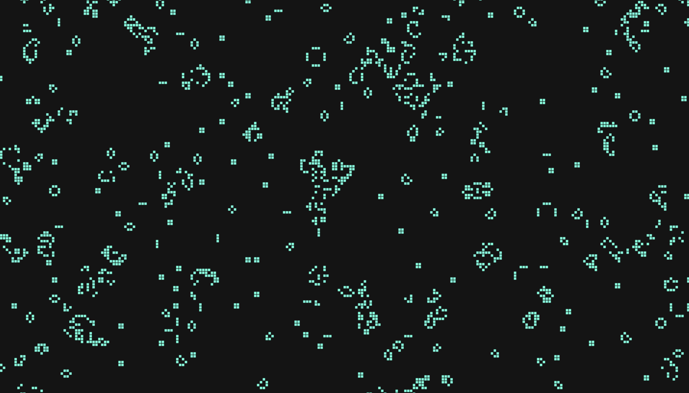

<div align="center">

  <h1><code>Game of Life Using Rust and Web Assembly</code></h1>


  <sub>Built with 🦀 by <a href="https://github.com/ryanflynndev">Ryan Flynn</a></sub>
</div>




## About

This is the game of life built using Rust, Web Assembly and Vanilla JavaScript.


### 🛠️ Build with `wasm-pack build`

```
wasm-pack build
```

### 🏃 Run the server

You can run the server by navigating into the www directory and running the command:

```
npm run start
```

